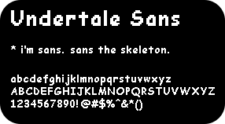
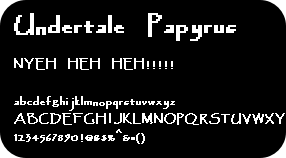

This project provides TTF and web-font versions of the versions of Comic Sans and Papyrus used in [Undertale](http://undertale.com) for dialogue.

 

                      

 

Harry Wakamatsu's [Determination Mono](https://www.behance.net/gallery/31268855/Determination-Better-Undertale-Font) is also provided as a web font.

## Downloading the fonts

If you want to use the fonts on your computer, click "Files", then "Download zip". The font files you're looking for are in the "ttf" folder.

## Using the fonts on your website

Add this line of code to your website to use the web fonts:

    <link rel="stylesheet" type="text/css" href="//undertalefonts.duodecima.technology/webfonts/stylesheet.css">

Then, you'll be able to use the fonts "Determination Mono", "Undertale Sans", and "Untertale Papyrus" on your website.

You can also use the fonts by downloading them and uploading the "webfonts" folder to your website. Then, change "undertalefonts.duodecima.technology" to your website's domain in the code. If you do that, your fonts will still work even if someday my website goes down.